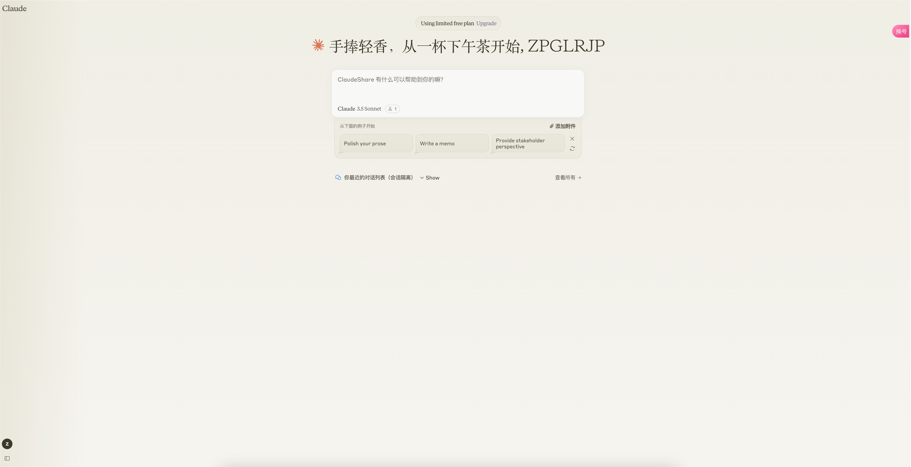

# soruxgpt-claude-share-deploy
一个为 Claude 准备的账号矩阵镜像面板

# 项目模式

本项目按项目 + 网关费用收费，项目为账号矩阵镜像面板，一次性收费。网关费用按流量 QPS 收费。详情联系微信：xosoder。

# 项目截图

# 项目配置

- CHATPROXY: 网关地址
- AUTHKEY: 网关鉴权密钥
- PORT: 端口
- OAUTH_URL: 登录鉴权地址（当登录时，若含有此项，则会POST此地址）
- AUDIT_LIMIT_URL: 鉴权地址（当对话时，会POST此地址）
- MY_SELF: 反代域名
- APIAUTH: API 调用密钥
- NOTIFY_URL: 通知地址，当成功完成一次对话时，会主动通知此地址
- ROAM_CONVERSATION: true/false 是否开启漫游
- LOG_OUT_AS_GO_TO_LIST: true/false 是否将左下角退出直接跳转到选车页面（即无需清空Session）
- SUIT_FOR_SHARE_IN_SESSION: 是否使用默认 SESSION，以兼容其他项目
